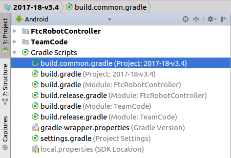

# EasyOpenCV

NOTE: SDK v5.1+ is required to use this

NOTE: an OpenRC-based SDK is NOT required to use this

Finally, a straightforward and easy way to use OpenCV on an FTC robot! With this library, you can **go from a stock SDK to running a sample OpenCV OpMode, with either an internal or external camera, in just a few minutes!**

Features at a glance:

 - Supports Driver Station camera preview feature introduced in SDK v5.1
 - Supports tapping on the viewport to cycle through the various stages of a pipeline (see [PipelineStageSwitchingExample](https://github.com/OpenFTC/EasyOpenCV/blob/master/examples/src/main/java/org/openftc/easyopencv/examples/PipelineStageSwitchingExample.java))
 - Supports using webcams directly with OpenCV instead of going through a Vuforia instance
 - Supports changing pipelines on-the-fly (while a streaming session is in flight)
 - Supports dynamically pausing/resuming live viewport to save battery and CPU time
 -  Support for rotating stream based on physical camera orientation (e.g. use a webcam in portrait without having to mess with rotation yourself)
 - Loads 10MB native library for OpenCV from internal storage to prevent bloating the APK
 
## Device compatibility:

Unfortunately, due to a [known bug with OpenCV 4.x](https://github.com/opencv/opencv/issues/15389), EasyOpenCV is only compatible with devices that run Andorid 5.0 or higher. For FTC, this means that it is incompatible with the ZTE Speed. EasyOpenCV will work fine on all other FTC-legal devices (including the new Control Hub).

## Installation instructions:

**IMPORTANT NOTE: This tutorial assumes you are starting with a clean SDK project. This library includes the OpenCV Android SDK, so if you have already installed OpenCV in your project through the traditional means, you will need to remove it first. Otherwise, you will get a compiler error that multiple files define the same class.**

1. Open your FTC SDK Android Studio project
2. Open the `build.common.gradle` file:

    

3. Add `jcenter()` to the `repositories` block at the bottom:

    

4. Open the `build.gradle` file for the TeamCode module:

    

5. At the bottom, add this:

        dependencies {
            implementation 'org.openftc:easyopencv:1.1'
         }

6. Now perform a Gradle Sync:

    

7. Because EasyOpenCv depends on [OpenCV-Repackaged](https://github.com/OpenFTC/OpenCV-Repackaged), you will also need to copy [`libOpenCvNative.so`](https://github.com/OpenFTC/OpenCV-Repackaged/blob/master/doc/libOpenCvNative.so) from the `/doc` folder of that repo into the `FIRST` folder on the internal storage of the Robot Controller.

8. Congrats, you're ready to go! Now check out the [example OpModes](https://github.com/OpenFTC/EasyOpenCV/tree/master/examples/src/main/java/org/openftc/easyopencv/examples).

## Known Issues:

Feel free to submit a pull request if you know how to fix any of these!

 - Currently, this library uses the SDK's built-in UVC driver for webcam support. Unforutnetly, the SDK's UVC driver is a buggy mess. This can cause all sorts of undesirable things to happen, such as crashes on USB disconnection, (or, if it survived the USB disconnection, hanging/deadlock when trying to stop the OpMode after the connection was restored), crashing of the Linux kernel if run too many times in a row, etc. However, the architecture of this library has been designed such that it would be straightforward to integrate an alternate implementation that would use a 3rd party UVC driver.
 - Internal camera support is currently provided via the Android Camera v1 API. This means that manual focus/exposure/ISO control is not possible. However, the architecture of this library has been designed such that it would be straightforward to integrate an alternate implementation that used the Camera v2 API.

## Changelog:

### v1.1

 - SDK v5.1 or higher now required
 - Add support for stream preview on Driver Station
 - Fix bug where internal camera was not correctly released
 - Fix bug where a null pipeline caused a crash
 - API change: user pipelines now need to `extends OpenCvPipeline` instead of `implements OpenCvPipeline`
 - Add ability for user pipeline to override `onViewportTapped()` to be notified if the user taps the viewport
 - Add `PipelineStageSwitchingExample` to show how to use `onViewportTapped()` to change which stage of your pipeline is drawn to the viewport for debugging purposes. It also shows how to get data from your pipeline to your OpMode.

### v1.0

 - Initial release
